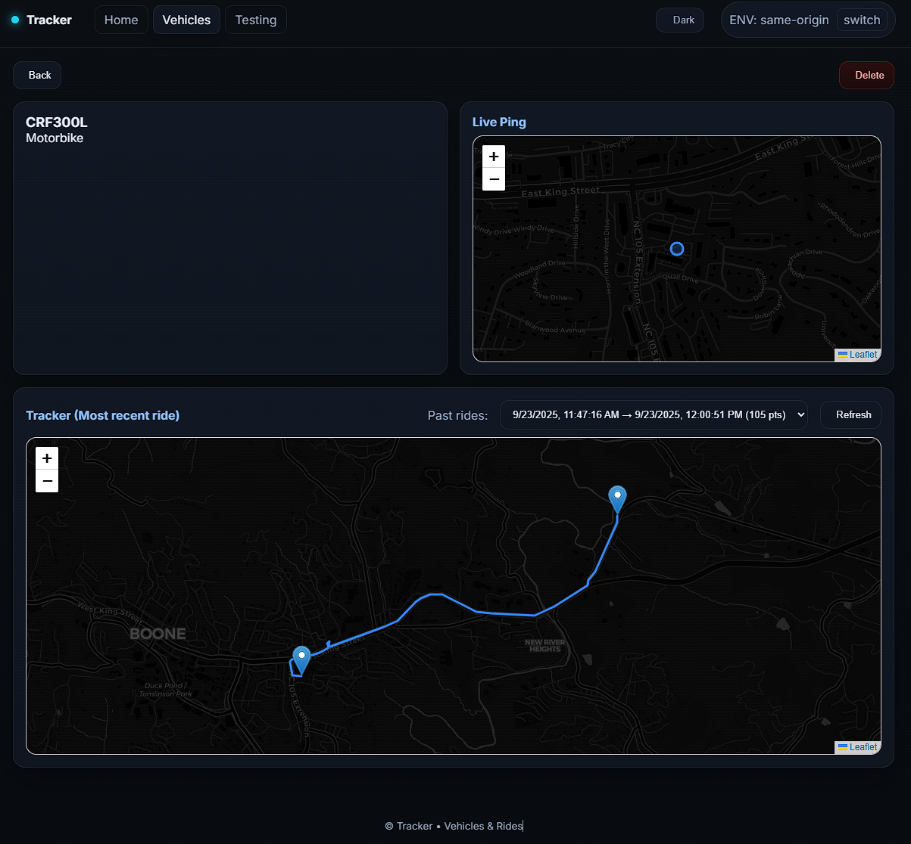

🏍️ Motorbike GPS Tracker

A web-based real-time GPS tracker I built to replace Apple AirTags on my motorbike. The app logs live pings from a GPS device, displays routes on an interactive map, and organizes rides by vehicle.

Features
- Live GPS tracking – See your bike’s current location on a map in real time.

- Route logging – Store and review past rides with timestamps and coordinates.

- Dark mode UI – Clean, responsive dashboard built with React + Tailwind CSS.

- Backend powered by Node.js + PostgreSQL – Data stored securely with scalable design.

📷 Screenshots
Home Dashboard

Overview with live demo tracker and personal intro

Vehicle Tracker

Vehicle page with live ping + most recent ride path

🛠️ Tech Stack

Frontend: React, TypeScript, Tailwind CSS

Backend: Node.js / Express (forked from [alphasecio/nodejs](https://github.com/alphasecio/nodejs) template
, then customized for GPS tracking + database integration)

Database: PostgreSQL (Prisma ORM)

Mapping: Leaflet.js

Hosting: Railway
